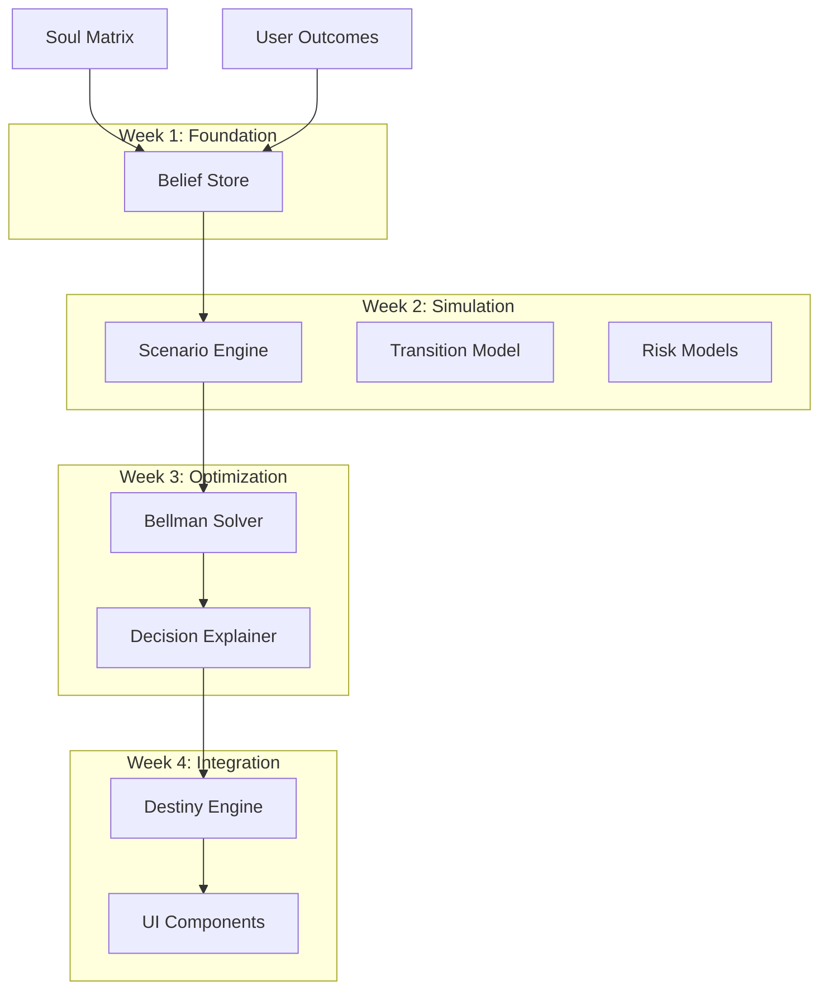

# Phase 3: Digital Twin Optimization Engine (DTOE)

## 概述

Phase 3 实现了 Lumi.AI 的核心优化引擎，采用粒子滤波 + MPC (Model Predictive Control) 架构，为用户提供个性化的人生资本优化建议。

---

## 架构图



---

## 核心服务

### 1. 状态与类型定义

**文件**: `services/twinTypes.ts`

```typescript
// 10维状态向量
type StateKey = 'wealth' | 'health' | 'skill' | 'energy' | 'social' 
              | 'career' | 'reputation' | 'time_buffer' | 'stress' | 'optionality';

// 粒子结构
interface Particle {
    state: TwinState;    // 当前状态估计
    params: TwinParams;  // 个人参数 (执行力、风险偏好等)
    weight: number;      // 粒子权重
}

// 动作类型
type ActionType = 'focus_work' | 'focus_study' | 'exercise' | 'sleep_earlier' 
                | 'networking' | 'ship_milestone' | 'delegate' | ...;
```

---

### 2. 信念状态管理

**文件**: `services/twinBeliefStore.ts`

核心功能:
- `createBeliefState()` - 初始化1000个粒子
- `updateBeliefWithEvidence()` - 重要性重权重
- `resampleParticles()` - 低方差系统重采样
- `getMeanState()` / `getStdState()` - 统计提取

```typescript
// 证据更新流程
function updateBeliefWithEvidence(belief: BeliefState, evidence: TwinEvidence): BeliefState {
    // 1. 计算似然
    const likelihoods = belief.particles.map(p => computeLikelihood(p, evidence));
    
    // 2. 重权重
    const updatedParticles = reweightParticles(belief.particles, likelihoods);
    
    // 3. 检查ESS，必要时重采样
    if (computeESS(updatedParticles) < threshold) {
        return resampleParticles(updatedParticles);
    }
    return { ...belief, particles: updatedParticles };
}
```

---

### 3. 场景引擎

**文件**: `services/scenarioEngine.ts`

Monte Carlo 场景生成:
- 种子化PRNG (Mulberry32)
- 支持 Box-Muller 正态分布
- 生成外生冲击: `market_return`, `health_shock`, `expense_shock`
- 生成执行标志: 基于用户坚持率

```typescript
// 渐进式场景生成 (响应式UI)
async function generateScenariosProgressive(
    spec: ScenarioSpec,
    params: TwinParams,
    onProgress?: (bundle: ScenarioBundle, pass: number) => void
): Promise<ScenarioBundle>;
```

---

### 4. 状态转移模型

**文件**: `services/transition.ts`

动作效果映射:

| 动作 | 主要效果 | 副作用 |
|------|----------|--------|
| `focus_work` | career +2%, skill +1% | energy -3%, stress +2% |
| `exercise` | health +3%, energy +2% | stress -3% |
| `networking` | social +3%, reputation +1% | energy -2% |
| `ship_milestone` | career +4%, reputation +2% | energy -4%, stress +3% |

```typescript
function transition(input: TransitionInput): TwinState {
    // 应用动作效果
    // 应用外生冲击
    // 自然动力学 (均值回归、衰减)
    // 约束到 [0, 1]
}
```

---

### 5. 风险模型

**文件**: `services/riskModels.ts`

关键指标:
- **VaR** (Value at Risk): 5%分位损失
- **CVaR** (Conditional VaR): 尾部期望损失
- **下行偏离**: 负收益标准差
- **风险调整得分**: mean - ρ × |CVaR|

```typescript
function computeRiskMetrics(samples: number[], baseline: number): RiskMetrics {
    return {
        mean, std, var_5, cvar_5,
        p_violate, downside_deviation, risk_adjusted_score
    };
}
```

---

### 6. Bellman 求解器

**文件**: `services/bellmanSolver.ts`

MPC 优化流程:
1. 生成动作模板 (11种 × 3强度 = 33个)
2. 对每个动作进行500场景 × 8步 rollout
3. 计算风险调整得分
4. 排序返回最优动作

```typescript
function solve(belief: BeliefState, objective: CompiledObjective): SolveResult {
    // 从信念提取均值状态/参数
    // 生成场景
    // 评估每个动作
    // 返回排序结果 + 解释
}
```

---

### 7. 决策解释器

**文件**: `services/decisionExplainer.ts`

输出格式:
- `ExplanationCard`: UI卡片数据
- `DetailedExplanation`: 完整分析
- `generateNarrative()`: 自然语言叙述

---

### 8. 命运引擎 (编排器)

**文件**: `services/destinyEngine.ts`

主API:
```typescript
// 获取建议
const rec = await getRecommendation({ time: 60, money: 40, risk: 50, ... });

// 记录结果
recordOutcome('task_123', 'success', 4);

// 周回顾
recordWeeklyReview('2026-W05', 8, 10);

// 状态摘要
const state = getStateSummary();  // { wealth, health, energy, stress, ... }
```

---

## UI 组件

### DestinyRecommendationCard

完整建议卡片，包含:
- 标题 + 副标题
- 指标行 (预期收益、风险等级、置信度)
- 状态条 (财富/健康/精力/压力)
- 备选方案列表
- 自然语言叙述
- 采纳按钮

### DestinyPanel

CommandCenter 折叠面板:
- 4个状态环 (SVG 圆环图)
- 建议摘要
- "查看详情" 按钮

---

## Domain Guard (优先级0)

解决 "火车票 → 电商链接" 路由污染问题。

三层防护:

| 层级 | 文件 | 实现 |
|------|------|------|
| 类型 | `intentRouterTypes.ts` | `allow_market_fanout: boolean` |
| 路由 | `intentRouterService.ts` | 仅 `commerce` 域设为 true |
| 工具 | `toolRegistry.ts` | `broadcast_intent` 检查类别 |
| UI | `SuperAgentResultPanel.tsx` | 门控 `OfferComparisonCard` |

---

## 测试结果


---

## 文件列表

| 类别 | 文件 |
|------|------|
| 类型 | `twinTypes.ts`, `twinEvidenceTypes.ts` |
| 服务 | `twinBeliefStore.ts`, `scenarioEngine.ts`, `transition.ts`, `riskModels.ts`, `bellmanSolver.ts`, `decisionExplainer.ts`, `destinyEngine.ts` |
| 组件 | `DestinyRecommendationCard.tsx`, `DestinyPanel.tsx` |
| 修改 | `intentRouterTypes.ts`, `intentRouterService.ts`, `toolRegistry.ts`, `SuperAgentResultPanel.tsx`, `CommandCenter.tsx` |

---

## 构建状态

✅ `npm run build` 通过 (4.94s)
